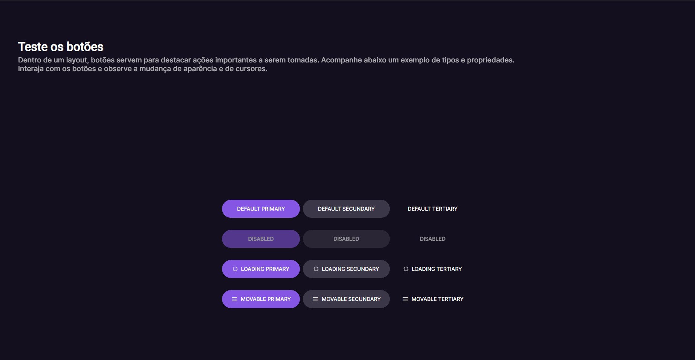

  

  

## 🖥️ Projeto
Esse é um projeto web no desafio do hora de codar, onde feito uma pagina web demonstrando os tipos e as diversas propriedades dos botões,
onde você pode interagir com os botões e observar a mudança de aparência e de cursores.

## 🚀 Tecnologias
Esse projeto foi desenvolvido durante o desafio #boracodar da Rocketsat com as seguintes tecnologias:

- HTML
- CSS
- GIT E GITHUB
- FIGMA

## 🏷️layout
Você pode visualizar o layout do projeto através 
[desse link](https://www.figma.com/file/27xf8WZAIBAr3VRPMFQMwz/Bot%C3%B5es-e-Cursores-%E2%80%A2-Desafio-03-(Community)?node-id=1%3A133&mode=dev).
É necessario ter uma conta no [Figma](https://www.figma.com).